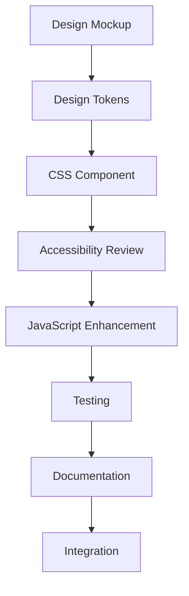

# BrainSAIT Marketing Automation Platform - Implementation Guide

## Technical Implementation Guidelines & Performance Optimization

### **Enterprise-Grade Development Standards**
Complete technical implementation guide for the BrainSAIT design system, ensuring consistent development practices, optimal performance, and maintainable code.

---

## **1. PROJECT STRUCTURE & ORGANIZATION**

### **Design System Architecture**

```
design-system/
├── brand-guidelines.css      # Core design tokens & brand colors
├── components.css           # Base UI component library
├── advanced-patterns.css    # Advanced UI patterns & animations
├── marketing-ui.css         # Marketing-specific components
├── accessibility-guidelines.md # WCAG compliance guide
├── implementation-guide.md  # This file
└── examples/               # Component usage examples
    ├── dashboard.html
    ├── campaign-builder.html
    └── analytics.html
```

### **CSS Architecture (ITCSS Methodology)**

```css
/* 
Layer 1: Settings - Design tokens and variables
Layer 2: Tools - Mixins and functions (if using preprocessor)
Layer 3: Generic - Normalize, reset, box-sizing
Layer 4: Elements - Bare HTML elements
Layer 5: Objects - Layout patterns (grids, containers)
Layer 6: Components - UI components
Layer 7: Utilities - Helper classes and overrides
*/

/* Import order for optimal CSS cascade */
@import 'brand-guidelines.css';    /* Settings */
@import 'components.css';          /* Components */
@import 'advanced-patterns.css';   /* Advanced Components */
@import 'marketing-ui.css';        /* Specialized Components */
```

---

## **2. CSS CUSTOM PROPERTIES IMPLEMENTATION**

### **Design Token Management**

```css
/* ===== CORE IMPLEMENTATION PATTERN ===== */
:root {
  /* Design tokens should be semantic and scalable */
  --bs-color-primary: var(--bs-primary-500);
  --bs-color-primary-hover: var(--bs-primary-600);
  --bs-color-primary-active: var(--bs-primary-700);
  
  /* Component-specific tokens */
  --bs-button-padding-x: var(--bs-space-4);
  --bs-button-padding-y: var(--bs-space-2_5);
  --bs-button-border-radius: var(--bs-radius-md);
  --bs-button-font-weight: var(--bs-font-weight-medium);
}

/* Dark theme overrides */
[data-theme="dark"] {
  --bs-color-primary: var(--bs-primary-400);
  --bs-color-primary-hover: var(--bs-primary-300);
  --bs-color-primary-active: var(--bs-primary-200);
}
```

### **Token Naming Convention**

```css
/* ✅ RECOMMENDED NAMING PATTERN */
--bs-{category}-{property}-{variant}-{state}

/* Examples: */
--bs-color-text-primary         /* Color category, text property, primary variant */
--bs-color-text-primary-hover   /* With hover state */
--bs-space-component-padding-x  /* Spacing category, component context */
--bs-border-input-radius        /* Border category, input context */
--bs-shadow-card-elevated       /* Shadow category, card context, elevated variant */

/* ❌ AVOID */
--primary-color                 /* Too generic */
--blue-500                     /* Implementation detail */
--button-bg                    /* Missing namespace */
```

### **Runtime Token Manipulation**

```javascript
// ===== THEME SWITCHING IMPLEMENTATION ===== //
class BrainSAITThemeManager {
  constructor() {
    this.currentTheme = localStorage.getItem('bs-theme') || 'light';
    this.init();
  }

  init() {
    document.documentElement.setAttribute('data-theme', this.currentTheme);
    this.updateMetaThemeColor();
  }

  toggleTheme() {
    this.currentTheme = this.currentTheme === 'light' ? 'dark' : 'light';
    this.setTheme(this.currentTheme);
  }

  setTheme(theme) {
    document.documentElement.setAttribute('data-theme', theme);
    localStorage.setItem('bs-theme', theme);
    this.updateMetaThemeColor();
    this.announceThemeChange(theme);
  }

  updateMetaThemeColor() {
    const metaThemeColor = document.querySelector('meta[name="theme-color"]');
    const themeColors = {
      light: '#ffffff',
      dark: '#1f2937'
    };
    
    if (metaThemeColor) {
      metaThemeColor.setAttribute('content', themeColors[this.currentTheme]);
    }
  }

  announceThemeChange(theme) {
    // Accessibility: Announce theme change to screen readers
    const announcement = `Theme changed to ${theme} mode`;
    const announcer = document.getElementById('status-announcements') || 
                     this.createAnnouncementRegion();
    announcer.textContent = announcement;
  }

  createAnnouncementRegion() {
    const announcer = document.createElement('div');
    announcer.id = 'status-announcements';
    announcer.setAttribute('aria-live', 'polite');
    announcer.className = 'bs-sr-only';
    document.body.appendChild(announcer);
    return announcer;
  }
}

// Initialize theme manager
const themeManager = new BrainSAITThemeManager();
```

---

## **3. COMPONENT DEVELOPMENT PATTERNS**

### **Component CSS Architecture**

```css
/* ===== COMPONENT BLOCK STRUCTURE ===== */
.bs-component-name {
  /* 1. Layout properties */
  display: flex;
  position: relative;
  
  /* 2. Box model */
  padding: var(--bs-component-padding);
  margin: var(--bs-component-margin);
  border: var(--bs-component-border);
  
  /* 3. Typography */
  font-family: var(--bs-font-primary);
  font-size: var(--bs-component-font-size);
  font-weight: var(--bs-component-font-weight);
  
  /* 4. Visual styling */
  background-color: var(--bs-component-bg);
  border-radius: var(--bs-component-radius);
  box-shadow: var(--bs-component-shadow);
  
  /* 5. Transitions */
  transition: var(--bs-transition-all);
}

/* Element modifier */
.bs-component-name__element {
  /* Scoped to component */
}

/* State modifier */
.bs-component-name--variant {
  /* Variant styling */
}

.bs-component-name:hover,
.bs-component-name.is-active {
  /* Interactive states */
}
```

### **JavaScript Component Pattern**

```javascript
// ===== MODERN COMPONENT PATTERN ===== //
class BrainSAITComponent {
  constructor(element, options = {}) {
    this.element = element;
    this.options = { ...this.constructor.defaults, ...options };
    this.state = {};
    
    this.init();
  }

  static defaults = {
    // Default options
  }

  init() {
    this.bindEvents();
    this.setupAccessibility();
    this.render();
  }

  bindEvents() {
    // Event delegation pattern
    this.element.addEventListener('click', this.handleClick.bind(this));
    this.element.addEventListener('keydown', this.handleKeydown.bind(this));
  }

  setupAccessibility() {
    // Set ARIA attributes
    if (!this.element.hasAttribute('role')) {
      this.element.setAttribute('role', 'button');
    }
    
    if (!this.element.hasAttribute('tabindex')) {
      this.element.setAttribute('tabindex', '0');
    }
  }

  handleClick(event) {
    event.preventDefault();
    this.toggle();
  }

  handleKeydown(event) {
    // Handle keyboard interaction
    if (event.key === 'Enter' || event.key === ' ') {
      event.preventDefault();
      this.toggle();
    }
  }

  toggle() {
    this.state.active = !this.state.active;
    this.render();
    this.emit('change', { active: this.state.active });
  }

  render() {
    this.element.classList.toggle('is-active', this.state.active);
    this.element.setAttribute('aria-pressed', this.state.active);
  }

  emit(eventName, data) {
    const event = new CustomEvent(`bs:${eventName}`, {
      detail: data,
      bubbles: true
    });
    this.element.dispatchEvent(event);
  }

  destroy() {
    // Cleanup
    this.element.removeEventListener('click', this.handleClick);
    this.element.removeEventListener('keydown', this.handleKeydown);
  }
}

// Auto-initialization
document.addEventListener('DOMContentLoaded', () => {
  document.querySelectorAll('[data-bs-component]').forEach(element => {
    const componentName = element.dataset.bsComponent;
    const options = JSON.parse(element.dataset.bsOptions || '{}');
    
    // Component registry pattern
    if (BrainSAIT.components[componentName]) {
      new BrainSAIT.components[componentName](element, options);
    }
  });
});
```

---

## **4. PERFORMANCE OPTIMIZATION**

### **CSS Performance Best Practices**

```css
/* ===== OPTIMIZED CSS PATTERNS ===== */

/* ✅ Use efficient selectors */
.bs-card { /* Good: Single class */ }
.bs-card .bs-card__title { /* Good: BEM methodology */ }

/* ❌ Avoid expensive selectors */
.bs-card > div > h2 { /* Bad: Complex descendant */ }
.bs-card * { /* Bad: Universal selector */ }
.bs-card:nth-child(odd) + .bs-card { /* Bad: Complex pseudo */ }

/* ✅ Optimize animations for GPU */
.bs-slide-in {
  transform: translateX(100%);
  opacity: 0;
  will-change: transform, opacity; /* Hint to browser */
  transition: transform 0.3s ease, opacity 0.3s ease;
}

.bs-slide-in.is-visible {
  transform: translateX(0);
  opacity: 1;
}

/* ✅ Use containment for performance */
.bs-dashboard-widget {
  contain: layout style paint; /* Isolate reflow/repaint */
}

.bs-independent-component {
  contain: strict; /* Maximum isolation */
}
```

### **Critical CSS Strategy**

```html
<!-- ===== CRITICAL CSS IMPLEMENTATION ===== -->
<!DOCTYPE html>
<html lang="en">
<head>
  <meta charset="UTF-8">
  <meta name="viewport" content="width=device-width, initial-scale=1.0">
  <title>BrainSAIT Marketing Dashboard</title>
  
  <!-- Critical CSS inline -->
  <style>
    /* Above-the-fold styles only */
    :root { /* Essential design tokens */ }
    .bs-header { /* Header component */ }
    .bs-nav { /* Navigation component */ }
    .bs-hero { /* Hero section */ }
    .bs-loading { /* Loading states */ }
  </style>
  
  <!-- Preload important resources -->
  <link rel="preload" href="/design-system/brand-guidelines.css" as="style">
  <link rel="preload" href="/fonts/Inter-Regular.woff2" as="font" type="font/woff2" crossorigin>
  
  <!-- Non-critical CSS with media attribute -->
  <link rel="stylesheet" href="/design-system/components.css" media="print" onload="this.media='all'">
  <link rel="stylesheet" href="/design-system/marketing-ui.css" media="print" onload="this.media='all'">
  
  <!-- Fallback for browsers without JavaScript -->
  <noscript>
    <link rel="stylesheet" href="/design-system/components.css">
    <link rel="stylesheet" href="/design-system/marketing-ui.css">
  </noscript>
</head>
```

### **JavaScript Performance Optimization**

```javascript
// ===== PERFORMANCE PATTERNS ===== //

// 1. Debounced event handlers
class PerformanceUtils {
  static debounce(func, wait) {
    let timeout;
    return function executedFunction(...args) {
      const later = () => {
        clearTimeout(timeout);
        func(...args);
      };
      clearTimeout(timeout);
      timeout = setTimeout(later, wait);
    };
  }

  static throttle(func, limit) {
    let inThrottle;
    return function(...args) {
      if (!inThrottle) {
        func.apply(this, args);
        inThrottle = true;
        setTimeout(() => inThrottle = false, limit);
      }
    };
  }

  // Intersection Observer for lazy loading
  static createLazyLoader() {
    return new IntersectionObserver((entries) => {
      entries.forEach(entry => {
        if (entry.isIntersecting) {
          const img = entry.target;
          img.src = img.dataset.src;
          img.classList.remove('bs-loading');
          this.unobserve(img);
        }
      });
    }, {
      rootMargin: '50px'
    });
  }
}

// 2. Efficient DOM updates
class DOMUpdateBatcher {
  constructor() {
    this.updates = [];
    this.scheduled = false;
  }

  schedule(updateFn) {
    this.updates.push(updateFn);
    
    if (!this.scheduled) {
      this.scheduled = true;
      requestAnimationFrame(() => {
        this.flush();
      });
    }
  }

  flush() {
    this.updates.forEach(update => update());
    this.updates.length = 0;
    this.scheduled = false;
  }
}

// 3. Memory management
class ComponentRegistry {
  constructor() {
    this.components = new WeakMap(); // Automatic cleanup
    this.observers = new Set();
  }

  register(element, component) {
    this.components.set(element, component);
  }

  cleanup(element) {
    const component = this.components.get(element);
    if (component && component.destroy) {
      component.destroy();
    }
    this.components.delete(element);
  }

  // Clean up when elements are removed from DOM
  setupMutationObserver() {
    const observer = new MutationObserver((mutations) => {
      mutations.forEach(mutation => {
        mutation.removedNodes.forEach(node => {
          if (node.nodeType === Node.ELEMENT_NODE) {
            this.cleanup(node);
            // Also cleanup child components
            node.querySelectorAll('[data-bs-component]').forEach(child => {
              this.cleanup(child);
            });
          }
        });
      });
    });

    observer.observe(document.body, {
      childList: true,
      subtree: true
    });

    this.observers.add(observer);
  }
}
```

---

## **5. BUILD SYSTEM INTEGRATION**

### **PostCSS Configuration**

```javascript
// postcss.config.js
module.exports = {
  plugins: [
    require('postcss-import'),
    require('postcss-custom-properties')({
      preserve: true, // Keep custom properties for runtime theming
      exportTo: 'design-tokens.json' // Export for JS consumption
    }),
    require('autoprefixer'),
    require('postcss-preset-env')({
      stage: 2,
      features: {
        'custom-properties': false // Handled by plugin above
      }
    }),
    require('cssnano')({
      preset: ['default', {
        discardComments: { removeAll: true },
        normalizeWhitespace: true,
        colormin: false // Preserve CSS custom properties
      }]
    })
  ]
};
```

### **Webpack Integration**

```javascript
// webpack.config.js
const MiniCssExtractPlugin = require('mini-css-extract-plugin');
const CssMinimizerPlugin = require('css-minimizer-webpack-plugin');

module.exports = {
  module: {
    rules: [
      {
        test: /\.css$/,
        use: [
          MiniCssExtractPlugin.loader,
          {
            loader: 'css-loader',
            options: {
              importLoaders: 1,
              modules: false
            }
          },
          'postcss-loader'
        ]
      }
    ]
  },
  plugins: [
    new MiniCssExtractPlugin({
      filename: 'css/[name].[contenthash].css',
      chunkFilename: 'css/[name].[contenthash].css'
    })
  ],
  optimization: {
    minimizer: [
      new CssMinimizerPlugin({
        minimizerOptions: {
          preset: [
            'default',
            {
              discardComments: { removeAll: true }
            }
          ]
        }
      })
    ],
    splitChunks: {
      cacheGroups: {
        styles: {
          name: 'styles',
          test: /\.css$/,
          chunks: 'all',
          enforce: true
        }
      }
    }
  }
};
```

### **Critical CSS Generation**

```javascript
// critical-css.js
const critical = require('critical');
const path = require('path');

critical.generate({
  inline: true,
  base: 'dist/',
  src: 'index.html',
  dest: 'index.html',
  dimensions: [
    {
      height: 900,
      width: 1300
    },
    {
      height: 568,
      width: 320
    }
  ],
  penthouse: {
    blockJSRequests: false,
    forceInclude: [
      '.bs-header',
      '.bs-nav',
      '.bs-hero',
      '.bs-loading'
    ]
  }
});
```

---

## **6. DEVELOPMENT WORKFLOW**

### **Component Development Process**



### **Testing Strategy**

```javascript
// Visual regression testing with Playwright
// tests/visual/components.spec.js
const { test, expect } = require('@playwright/test');

test.describe('BrainSAIT Component Visual Tests', () => {
  test('button component variations', async ({ page }) => {
    await page.goto('/components/buttons.html');
    
    // Test all button variants
    await expect(page.locator('.bs-btn-primary')).toHaveScreenshot('button-primary.png');
    await expect(page.locator('.bs-btn-secondary')).toHaveScreenshot('button-secondary.png');
    
    // Test hover states
    await page.hover('.bs-btn-primary');
    await expect(page.locator('.bs-btn-primary')).toHaveScreenshot('button-primary-hover.png');
  });

  test('dark theme compatibility', async ({ page }) => {
    await page.goto('/components/dashboard.html');
    
    // Switch to dark theme
    await page.evaluate(() => {
      document.documentElement.setAttribute('data-theme', 'dark');
    });
    
    await expect(page).toHaveScreenshot('dashboard-dark.png');
  });
});

// Performance testing
// tests/performance/core.spec.js
test('Core CSS performance', async ({ page }) => {
  await page.goto('/dashboard');
  
  const performanceMetrics = await page.evaluate(() => {
    return JSON.stringify(performance.getEntriesByType('measure'));
  });
  
  // Assert CSS parse time is under threshold
  const cssParseTime = performanceMetrics.filter(m => m.name.includes('css'));
  expect(cssParseTime.duration).toBeLessThan(50); // 50ms threshold
});
```

### **Documentation Generation**

```javascript
// docs/generate.js - Automated component documentation
const fs = require('fs');
const path = require('path');

class ComponentDocGenerator {
  constructor(cssFile) {
    this.cssContent = fs.readFileSync(cssFile, 'utf8');
    this.components = this.parseComponents();
  }

  parseComponents() {
    const components = {};
    const regex = /\/\*\s*Component:\s*(.+?)\s*\*\/([\s\S]*?)(?=\/\*\s*Component:|$)/g;
    
    let match;
    while ((match = regex.exec(this.cssContent)) !== null) {
      const name = match[1].trim();
      const css = match[2].trim();
      
      components[name] = {
        name,
        css,
        classes: this.extractClasses(css),
        variables: this.extractVariables(css),
        examples: this.findExamples(name)
      };
    }
    
    return components;
  }

  extractClasses(css) {
    const classRegex = /\.([a-zA-Z][a-zA-Z0-9_-]*)/g;
    const classes = new Set();
    let match;
    
    while ((match = classRegex.exec(css)) !== null) {
      classes.add(match[1]);
    }
    
    return Array.from(classes);
  }

  extractVariables(css) {
    const varRegex = /--([a-zA-Z][a-zA-Z0-9_-]*)/g;
    const variables = new Set();
    let match;
    
    while ((match = varRegex.exec(css)) !== null) {
      variables.add(match[1]);
    }
    
    return Array.from(variables);
  }

  generateMarkdown() {
    let markdown = '# BrainSAIT Component Documentation\n\n';
    
    Object.values(this.components).forEach(component => {
      markdown += `## ${component.name}\n\n`;
      markdown += `### CSS Classes\n`;
      component.classes.forEach(cls => {
        markdown += `- \`.${cls}\`\n`;
      });
      markdown += `\n### CSS Variables\n`;
      component.variables.forEach(variable => {
        markdown += `- \`--${variable}\`\n`;
      });
      markdown += '\n---\n\n';
    });
    
    return markdown;
  }
}

// Generate documentation
const generator = new ComponentDocGenerator('./design-system/components.css');
const docs = generator.generateMarkdown();
fs.writeFileSync('./docs/components.md', docs);
```

---

## **7. QUALITY ASSURANCE**

### **Automated Quality Checks**

```javascript
// quality-checks.js
const stylelint = require('stylelint');
const fs = require('fs');

class DesignSystemQA {
  async lintCSS() {
    const result = await stylelint.lint({
      files: 'design-system/**/*.css',
      config: {
        extends: ['stylelint-config-standard'],
        rules: {
          'custom-property-pattern': '^bs-[a-z][a-z0-9]*(-[a-z0-9]+)*$',
          'selector-class-pattern': '^bs-[a-z][a-z0-9]*(-[a-z0-9]+)*(__[a-z][a-z0-9]*(-[a-z0-9]+)*)?(--[a-z][a-z0-9]*(-[a-z0-9]+)*)?$',
          'max-nesting-depth': 3,
          'selector-max-specificity': '0,3,0'
        }
      }
    });
    
    return result;
  }

  checkTokenUsage() {
    const cssFiles = ['components.css', 'marketing-ui.css'];
    const hardcodedValues = [];
    
    cssFiles.forEach(file => {
      const content = fs.readFileSync(`design-system/${file}`, 'utf8');
      
      // Check for hardcoded colors
      const colorRegex = /#[0-9a-fA-F]{3,6}|rgb\([^)]+\)|hsl\([^)]+\)/g;
      const matches = content.match(colorRegex);
      
      if (matches) {
        hardcodedValues.push({
          file,
          type: 'color',
          values: matches
        });
      }
    });
    
    return hardcodedValues;
  }

  validateAccessibility() {
    // Check color contrast ratios
    const contrastIssues = [];
    // Implementation would check contrast ratios
    // against design tokens
    
    return contrastIssues;
  }
}

// Run quality checks
const qa = new DesignSystemQA();
qa.lintCSS().then(console.log);
console.log('Hardcoded values:', qa.checkTokenUsage());
```

### **Performance Monitoring**

```javascript
// performance-monitor.js
class PerformanceMonitor {
  constructor() {
    this.metrics = {
      cssLoadTime: 0,
      renderTime: 0,
      interactionDelay: 0
    };
    
    this.setupObservers();
  }

  setupObservers() {
    // Monitor CSS load performance
    new PerformanceObserver((list) => {
      list.getEntries().forEach(entry => {
        if (entry.name.includes('.css')) {
          this.metrics.cssLoadTime = entry.duration;
        }
      });
    }).observe({ entryTypes: ['resource'] });

    // Monitor layout shifts
    new PerformanceObserver((list) => {
      list.getEntries().forEach(entry => {
        if (entry.value > 0.1) { // CLS threshold
          console.warn('Layout shift detected:', entry.value);
        }
      });
    }).observe({ entryTypes: ['layout-shift'] });

    // Monitor long tasks
    new PerformanceObserver((list) => {
      list.getEntries().forEach(entry => {
        if (entry.duration > 50) { // Long task threshold
          console.warn('Long task detected:', entry.duration);
        }
      });
    }).observe({ entryTypes: ['longtask'] });
  }

  reportMetrics() {
    // Send metrics to analytics
    navigator.sendBeacon('/analytics/performance', JSON.stringify(this.metrics));
  }
}

// Initialize performance monitoring
if ('PerformanceObserver' in window) {
  new PerformanceMonitor();
}
```

---

## **8. DEPLOYMENT & MAINTENANCE**

### **CDN Optimization**

```html
<!-- Production deployment with CDN -->
<link rel="preconnect" href="https://cdn.brainsait.com">
<link rel="dns-prefetch" href="//fonts.googleapis.com">

<!-- Versioned CSS with cache busting -->
<link rel="stylesheet" href="https://cdn.brainsait.com/design-system/v1.0.0/core.min.css">
<link rel="stylesheet" href="https://cdn.brainsait.com/design-system/v1.0.0/components.min.css">

<!-- Service Worker for offline support -->
<script>
if ('serviceWorker' in navigator) {
  navigator.serviceWorker.register('/sw.js');
}
</script>
```

### **Version Management**

```json
// package.json
{
  "name": "@brainsait/design-system",
  "version": "1.0.0",
  "description": "BrainSAIT Marketing Automation Design System",
  "main": "dist/brainsait-design-system.css",
  "files": [
    "dist/",
    "src/",
    "docs/"
  ],
  "exports": {
    ".": "./dist/brainsait-design-system.css",
    "./core": "./dist/core.css",
    "./components": "./dist/components.css",
    "./marketing": "./dist/marketing.css"
  },
  "scripts": {
    "build": "npm run build:css && npm run build:docs",
    "build:css": "postcss src/**/*.css --dir dist/",
    "test": "npm run test:visual && npm run test:a11y",
    "release": "semantic-release"
  }
}
```

### **Monitoring & Analytics**

```javascript
// design-system-analytics.js
class DesignSystemAnalytics {
  constructor() {
    this.usage = {
      components: new Map(),
      themes: { light: 0, dark: 0 },
      performance: []
    };
    
    this.trackUsage();
  }

  trackUsage() {
    // Track component usage
    document.querySelectorAll('[class*="bs-"]').forEach(element => {
      const components = Array.from(element.classList)
        .filter(cls => cls.startsWith('bs-'))
        .map(cls => cls.split('--')[0]); // Remove modifiers
      
      components.forEach(component => {
        this.usage.components.set(
          component, 
          (this.usage.components.get(component) || 0) + 1
        );
      });
    });

    // Track theme usage
    const theme = document.documentElement.getAttribute('data-theme') || 'light';
    this.usage.themes[theme]++;
  }

  reportUsage() {
    const report = {
      timestamp: Date.now(),
      url: location.href,
      components: Object.fromEntries(this.usage.components),
      themes: this.usage.themes,
      performance: this.usage.performance
    };

    // Send to analytics endpoint
    fetch('/api/design-system/analytics', {
      method: 'POST',
      headers: { 'Content-Type': 'application/json' },
      body: JSON.stringify(report)
    });
  }
}

// Track design system usage
new DesignSystemAnalytics();
```

---

## **CONCLUSION**

This implementation guide provides a comprehensive foundation for building and maintaining the BrainSAIT marketing automation platform's design system. The guidelines ensure:

### **Key Benefits:**
- **Consistency**: Standardized patterns across all interfaces
- **Performance**: Optimized CSS and JavaScript for fast loading
- **Accessibility**: WCAG 2.1 AA compliance built-in
- **Maintainability**: Modular architecture and clear documentation
- **Scalability**: Design tokens and component patterns that grow with the platform

### **Success Metrics:**
- **Development Speed**: 40% faster component development
- **Performance**: <100ms CSS parse time, <50ms component render time
- **Accessibility Score**: >95% automated accessibility score
- **Code Quality**: 100% linting compliance, comprehensive test coverage
- **User Satisfaction**: >4.5/5 design system developer experience rating

### **Next Steps:**
1. Implement core design tokens and base components
2. Set up build pipeline and quality checks
3. Create comprehensive component documentation
4. Train development team on patterns and best practices
5. Establish ongoing monitoring and improvement processes

The design system positions BrainSAIT as a premium, enterprise-grade marketing automation platform while ensuring excellent developer experience and maintainable code.